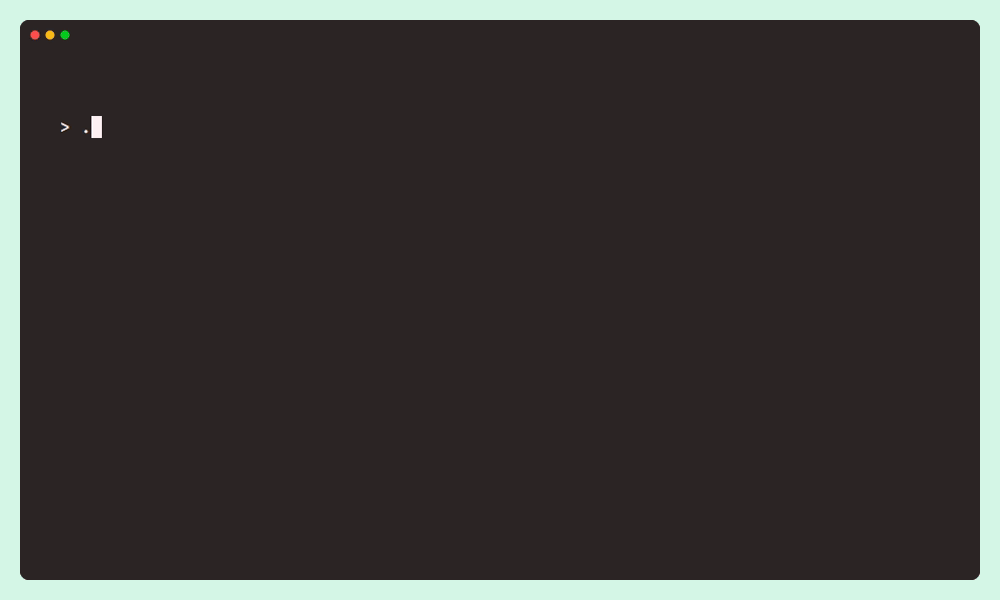

<a name="readme-top"></a>

<!-- PROJECT LOGO -->
<br />
<div align="center">
  <h1 align="center">Golang CLI Quizzer</h1>

  <p align="center">
    Turn a CSV of questions and answers into a quiz game in your command line interface!
  </p>
</div>



<!-- TABLE OF CONTENTS -->
<details>
  <summary>Table of Contents</summary>
  <ol>
    <li>
      <a href="#about-the-project">About The Project</a>
      <ul>
        <li><a href="#built-with">Built With</a></li>
      </ul>
    </li>
    <li>
      <a href="#getting-started">Getting Started</a>
      <ul>
        <li><a href="#prerequisites">Prerequisites</a></li>
        <li><a href="#installation">Installation</a></li>
      </ul>
    </li>
    <li><a href="#license">License</a></li>
    <li><a href="#contact">Contact</a></li>
    <li><a href="#acknowledgments">Acknowledgments</a></li>
  </ol>
</details>

<!-- ABOUT THE PROJECT -->

## About The Project

The Golang CLI Quizzer will read in a quiz provided by a CSV file. The CSV file must be in "question,answer" format. The player will be provided with one question at a time providing feedback as to whether each answer was correct or not. At the end of the quiz, the player will be shown the number of questions they answered correctly and how many questions there were in total.

The CSV file defaults to "problems.csv", but the user can choose a different csv file by using the "-csv" flag followed by the name of the file.

The time limit defaults to 30 seconds, but the user can choose a different time limit by using the "-timer" flag followed by a time limit in seconds.

Your quiz will stop as soon as the time limit has exceeded. Any unanswered questions will be deemed incorrect once the time limit is reached.

<p align="right">(<a href="#readme-top">back to top</a>)</p>

<!-- BUILT WITH -->

### Built With

[![Go][go-shield]][go-url]

<p align="right">(<a href="#readme-top">back to top</a>)</p>

<!-- GETTING STARTED -->

## Getting Started

### Prerequisites

-   Golang:
    [https://go.dev/doc/install](https://go.dev/doc/install)

### Installation

1. Clone the repo
    ```sh
    git clone https://github.com/cjsidler/go-cli-quizzer.git
    ```
2. Build an executable
    ```sh
    go build -o "go-cli-quizzer.exe" main.go
    ```
3. Run the executable. Flags are optional. Default csv filename is "problems.csv". Default time limit is 30 (seconds).
    ```sh
    .\go-cli-quizzer.exe -csv "my-quiz.csv" -timer 20
    ```

<p align="right">(<a href="#readme-top">back to top</a>)</p>

<!-- LICENSE -->

## License

[![MIT License][license-shield]][license-url]

<p align="right">(<a href="#readme-top">back to top</a>)</p>

<!-- CONTACT -->

## Contact

Contact me via email, LinkedIn, or GitHub:

[![Email][gmail-shield]][gmail-url]
[![LinkedIn][linkedin-shield]][linkedin-url]
[![GitHub][github-shield]][github-url]

<p align="right">(<a href="#readme-top">back to top</a>)</p>

<!-- ACKNOWLEDGMENTS -->

## Acknowledgments

-   [Gophercises](https://gophercises.com/)
-   [VHS Terminal Gifs](https://github.com/charmbracelet/vhs)
-   [README Template](https://github.com/othneildrew/Best-README-Template)
-   [Link Badges](https://shields.io/)

<p align="right">(<a href="#readme-top">back to top</a>)</p>

<!-- MARKDOWN LINKS & IMAGES -->

[license-shield]: https://img.shields.io/github/license/othneildrew/Best-README-Template.svg?style=for-the-badge
[license-url]: https://github.com/othneildrew/Best-README-Template/blob/master/LICENSE.txt
[linkedin-shield]: https://img.shields.io/badge/-LinkedIn-black.svg?style=for-the-badge&logo=linkedin&colorB=555
[linkedin-url]: https://www.linkedin.com/in/collinsidler/
[go-shield]: https://img.shields.io/badge/Golang-blue?style=for-the-badge&logo=go&logoColor=white
[go-url]: https://go.dev
[gmail-shield]: https://img.shields.io/badge/Gmail-D14836?style=for-the-badge&logo=gmail&logoColor=white
[gmail-url]: mailto:cjsidler@gmail.com
[github-shield]: https://img.shields.io/badge/GitHub-black?style=for-the-badge&logo=github&logoColor=white
[github-url]: https://github.com/cjsidler/go-cli-quizzer
